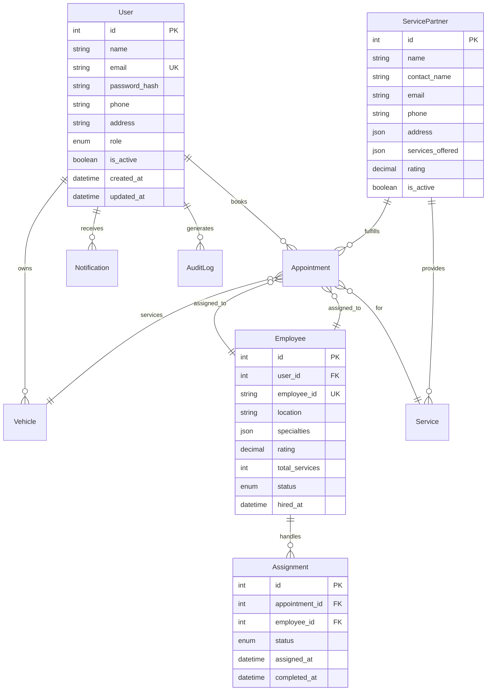

# AutoConcierge Backend Architecture Plan

## Executive Summary

This document outlines the comprehensive architecture plan to transform the AutoConcierge application from using mock data to a fully functional, secure, and scalable system with proper Role-Based Access Control (RBAC), real employee management, and seamless API integration.

---

## Current State Analysis

### What We Have

#### Database Models
- **User Model**: Basic user with role field (customer, employee, admin)
- **Admin Model**: Separate admin table (creates redundancy)
- **Service Model**: Service offerings
- **Vehicle Model**: Customer vehicles
- **Appointment Model**: Service appointments
- **ServiceHistory Model**: Completed service records
- **Notification Model**: User notifications
- **PaymentMethod Model**: User payment methods
- **DiscountCode Model**: Promotional codes

#### Authentication
- JWT-based authentication with Flask-JWT-Extended
- Separate login endpoints for users and admins
- SHA256 password hashing (weak)

#### API Routes
- `/api/auth/*` - Authentication endpoints
- `/api/services/*` - Service management
- `/api/appointments/*` - Appointment management
- `/api/vehicles/*` - Vehicle management
- `/api/admin/*` - Admin operations

### Critical Gaps Identified

1. **No Employee Model**: Employees are just users with role='employee' - no specialized fields
2. **No Employee Registration**: No way to register employees with proper credentials
3. **Weak RBAC**: Role checks are scattered and inconsistent
4. **Weak Security**: SHA256 hashing instead of bcrypt
5. **No API Integration**: Frontend uses mock data
6. **No Assignment System**: Employees cannot be assigned to appointments
7. **No Service Partner Model**: Partners are not in the database
8. **No Audit Logging**: No tracking of important actions

---

## Proposed Architecture

### 1. Unified User Model with Enhanced RBAC



### 2. Role-Based Access Control Matrix

| Resource | Customer | Employee | Admin | Super Admin |
|----------|----------|----------|-------|-------------|
| View Services | ✅ | ✅ | ✅ | ✅ |
| Book Appointment | ✅ | ❌ | ✅ | ✅ |
| View Own Appointments | ✅ | ❌ | ✅ | ✅ |
| View All Appointments | ❌ | ✅ | ✅ | ✅ |
| Update Appointment Status | ❌ | ✅ | ✅ | ✅ |
| Manage Services | ❌ | ❌ | ✅ | ✅ |
| Manage Employees | ❌ | ❌ | ✅ | ✅ |
| Manage Customers | ❌ | ❌ | ✅ | ✅ |
| View Analytics | ❌ | ❌ | ✅ | ✅ |
| Manage Admins | ❌ | ❌ | ❌ | ✅ |

### 3. Security Enhancements

#### Password Security
- Migrate from SHA256 to bcrypt with salt
- Implement password strength validation
- Add password reset functionality

#### JWT Configuration
```python
JWT_CONFIG = {
    'access_token_expires': timedelta(hours=1),
    'refresh_token_expires': timedelta(days=30),
    'algorithm': 'HS256',
    'identity_claim': 'sub',
    'user_claims': 'role'
}
```

#### Rate Limiting
- Login attempts: 5 per minute
- API calls: 100 per minute per user
- Password reset: 3 per hour

### 4. New Models to Implement

#### Employee Model
```python
class Employee(db.Model):
    __tablename__ = 'employees'
    
    id = db.Column(db.Integer, primary_key=True)
    user_id = db.Column(db.Integer, db.ForeignKey('users.id'), nullable=False)
    employee_id = db.Column(db.String(20), unique=True, nullable=False)  # C-001, C-002
    location = db.Column(db.String(100))
    specialties = db.Column(db.JSON)  # ['Luxury Vehicles', 'Detailing']
    rating = db.Column(db.Numeric(3, 2), default=0.0)
    total_services = db.Column(db.Integer, default=0)
    status = db.Column(db.String(20), default='active')  # active, off-duty, suspended
    hired_at = db.Column(db.DateTime, default=datetime.utcnow)
    
    # Relationships
    assignments = db.relationship('Assignment', backref='employee', lazy=True)
```

#### Assignment Model
```python
class Assignment(db.Model):
    __tablename__ = 'assignments'
    
    id = db.Column(db.Integer, primary_key=True)
    appointment_id = db.Column(db.Integer, db.ForeignKey('appointments.id'), nullable=False)
    employee_id = db.Column(db.Integer, db.ForeignKey('employees.id'), nullable=False)
    status = db.Column(db.String(20), default='assigned')  # assigned, in-progress, completed
    assigned_at = db.Column(db.DateTime, default=datetime.utcnow)
    started_at = db.Column(db.DateTime)
    completed_at = db.Column(db.DateTime)
    notes = db.Column(db.Text)
```

#### ServicePartner Model
```python
class ServicePartner(db.Model):
    __tablename__ = 'service_partners'
    
    id = db.Column(db.Integer, primary_key=True)
    name = db.Column(db.String(100), nullable=False)
    contact_name = db.Column(db.String(100))
    email = db.Column(db.String(120))
    phone = db.Column(db.String(20))
    address = db.Column(db.JSON)  # {street, city, country}
    services_offered = db.Column(db.JSON)  # ['Oil Change', 'Tire Rotation']
    rating = db.Column(db.Numeric(3, 2), default=0.0)
    is_active = db.Column(db.Boolean, default=True)
```

#### AuditLog Model
```python
class AuditLog(db.Model):
    __tablename__ = 'audit_logs'
    
    id = db.Column(db.Integer, primary_key=True)
    user_id = db.Column(db.Integer, db.ForeignKey('users.id'))
    action = db.Column(db.String(50), nullable=False)
    resource_type = db.Column(db.String(50))
    resource_id = db.Column(db.Integer)
    details = db.Column(db.JSON)
    ip_address = db.Column(db.String(45))
    created_at = db.Column(db.DateTime, default=datetime.utcnow)
```

### 5. API Endpoints Structure

#### Authentication Endpoints
```
POST   /api/auth/register          - Customer registration
POST   /api/auth/login             - Unified login (returns role-based token)
POST   /api/auth/logout            - Invalidate token
POST   /api/auth/refresh           - Refresh access token
POST   /api/auth/forgot-password   - Request password reset
POST   /api/auth/reset-password    - Reset password with token
GET    /api/auth/profile           - Get current user profile
PUT    /api/auth/profile           - Update profile
```

#### Employee Management Endpoints
```
POST   /api/admin/employees                    - Register new employee
GET    /api/admin/employees                    - List all employees
GET    /api/admin/employees/:id                - Get employee details
PUT    /api/admin/employees/:id                - Update employee
DELETE /api/admin/employees/:id                - Deactivate employee
PUT    /api/admin/employees/:id/status         - Update employee status
GET    /api/admin/employees/:id/assignments    - Get employee assignments
```

#### Employee Portal Endpoints
```
GET    /api/employee/dashboard      - Employee dashboard stats
GET    /api/employee/assignments    - Get my assignments
PUT    /api/employee/assignments/:id - Update assignment status
GET    /api/employee/schedule       - Get my schedule
PUT    /api/employee/profile        - Update my profile
```

#### Appointment Endpoints (Enhanced)
```
GET    /api/appointments                    - List appointments (role-filtered)
POST   /api/appointments                    - Create appointment
GET    /api/appointments/:id                - Get appointment details
PUT    /api/appointments/:id                - Update appointment
DELETE /api/appointments/:id                - Cancel appointment
POST   /api/appointments/:id/assign         - Assign employee to appointment
PUT    /api/appointments/:id/status         - Update appointment status
```

### 6. Frontend API Integration Strategy

#### API Service Layer
Create a centralized API service:

```typescript
// src/services/api.ts
const API_BASE_URL = import.meta.env.VITE_API_URL || 'http://localhost:5000/api';

class ApiService {
  private token: string | null = null;
  
  setToken(token: string) {
    this.token = token;
    localStorage.setItem('auth_token', token);
  }
  
  async request(endpoint: string, options: RequestInit = {}) {
    const headers = {
      'Content-Type': 'application/json',
      ...(this.token && { Authorization: `Bearer ${this.token}` }),
      ...options.headers,
    };
    
    const response = await fetch(`${API_BASE_URL}${endpoint}`, {
      ...options,
      headers,
    });
    
    if (response.status === 401) {
      // Handle token expiration
      this.logout();
    }
    
    return response.json();
  }
  
  // Auth methods
  async login(email: string, password: string) { ... }
  async register(data: RegisterData) { ... }
  
  // Appointment methods
  async getAppointments() { ... }
  async createAppointment(data: AppointmentData) { ... }
  
  // ... other methods
}

export const api = new ApiService();
```

#### React Query Integration
Use React Query for data fetching and caching:

```typescript
// src/hooks/useAppointments.ts
import { useQuery, useMutation, useQueryClient } from '@tanstack/react-query';
import { api } from '@/services/api';

export function useAppointments() {
  return useQuery({
    queryKey: ['appointments'],
    queryFn: () => api.getAppointments(),
  });
}

export function useCreateAppointment() {
  const queryClient = useQueryClient();
  
  return useMutation({
    mutationFn: (data: AppointmentData) => api.createAppointment(data),
    onSuccess: () => {
      queryClient.invalidateQueries({ queryKey: ['appointments'] });
    },
  });
}
```

### 7. Implementation Phases

#### Phase 1: Security Foundation (Week 1)
- [ ] Migrate password hashing to bcrypt
- [ ] Implement proper JWT configuration
- [ ] Add rate limiting middleware
- [ ] Create RBAC decorators
- [ ] Add input validation with marshmallow

#### Phase 2: Employee Management (Week 2)
- [ ] Create Employee model
- [ ] Create Assignment model
- [ ] Implement employee registration endpoint
- [ ] Create employee management endpoints
- [ ] Add employee portal endpoints

#### Phase 3: Service Partners (Week 3)
- [ ] Create ServicePartner model
- [ ] Implement partner management endpoints
- [ ] Link partners to services
- [ ] Add partner to appointment workflow

#### Phase 4: Frontend Integration (Week 4)
- [ ] Create API service layer
- [ ] Implement React Query
- [ ] Replace mock data with API calls
- [ ] Add loading states and error handling
- [ ] Implement real-time updates

#### Phase 5: Audit & Monitoring (Week 5)
- [ ] Create AuditLog model
- [ ] Implement audit logging middleware
- [ ] Add analytics endpoints
- [ ] Create admin dashboard with real data

---

## Database Migration Strategy

### Step 1: Create New Tables
```sql
-- Create employees table
CREATE TABLE employees (
    id INTEGER PRIMARY KEY AUTOINCREMENT,
    user_id INTEGER NOT NULL REFERENCES users(id),
    employee_id VARCHAR(20) UNIQUE NOT NULL,
    location VARCHAR(100),
    specialties JSON,
    rating DECIMAL(3,2) DEFAULT 0.0,
    total_services INTEGER DEFAULT 0,
    status VARCHAR(20) DEFAULT 'active',
    hired_at DATETIME DEFAULT CURRENT_TIMESTAMP
);

-- Create assignments table
CREATE TABLE assignments (
    id INTEGER PRIMARY KEY AUTOINCREMENT,
    appointment_id INTEGER NOT NULL REFERENCES appointments(id),
    employee_id INTEGER NOT NULL REFERENCES employees(id),
    status VARCHAR(20) DEFAULT 'assigned',
    assigned_at DATETIME DEFAULT CURRENT_TIMESTAMP,
    started_at DATETIME,
    completed_at DATETIME,
    notes TEXT
);

-- Create service_partners table
CREATE TABLE service_partners (
    id INTEGER PRIMARY KEY AUTOINCREMENT,
    name VARCHAR(100) NOT NULL,
    contact_name VARCHAR(100),
    email VARCHAR(120),
    phone VARCHAR(20),
    address JSON,
    services_offered JSON,
    rating DECIMAL(3,2) DEFAULT 0.0,
    is_active BOOLEAN DEFAULT TRUE
);

-- Create audit_logs table
CREATE TABLE audit_logs (
    id INTEGER PRIMARY KEY AUTOINCREMENT,
    user_id INTEGER REFERENCES users(id),
    action VARCHAR(50) NOT NULL,
    resource_type VARCHAR(50),
    resource_id INTEGER,
    details JSON,
    ip_address VARCHAR(45),
    created_at DATETIME DEFAULT CURRENT_TIMESTAMP
);
```

### Step 2: Migrate Existing Data
- Convert existing users with role='employee' to Employee records
- Generate employee_ids for existing employees
- Migrate admin users to unified User model with role='admin'

---

## Security Checklist

- [ ] All passwords hashed with bcrypt
- [ ] JWT tokens have short expiration
- [ ] Refresh tokens implemented
- [ ] Rate limiting on all auth endpoints
- [ ] Input validation on all endpoints
- [ ] SQL injection prevention (parameterized queries)
- [ ] CORS properly configured
- [ ] HTTPS enforced in production
- [ ] Environment variables for secrets
- [ ] Audit logging for sensitive actions

---

## Next Steps

1. **Review this architecture plan** and provide feedback
2. **Prioritize implementation phases** based on business needs
3. **Switch to Code mode** to begin implementation
4. **Start with Phase 1** (Security Foundation)
