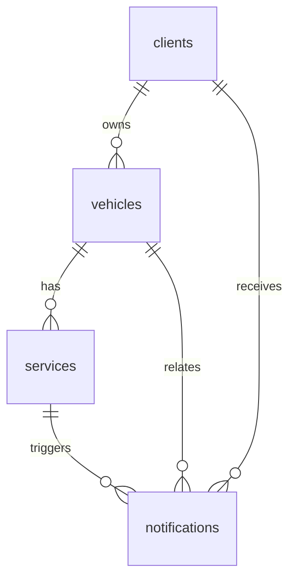

# Ndegwa Auto Concierge Platform - Database Schema Design

## Overview
This document outlines the PostgreSQL database schema for the Ndegwa Auto Concierge platform. The schema is designed to support the four core modules: Client Management, Vehicle & Service Tracking, Notification & Status, and Analytics & Reporting. It incorporates relationships, constraints, indexes, and optimizations for performance, security, and scalability.

Key considerations:
- **Data Types**: Uses appropriate PostgreSQL types for efficiency and validation.
- **Relationships**: Foreign keys establish links between entities.
- **Constraints**: Ensures data integrity (e.g., NOT NULL, UNIQUE, CHECK).
- **Indexes**: Added on frequently queried columns for performance.
- **Security**: Uses UUIDs for primary keys to avoid sequential ID exposure. Sensitive fields (e.g., email, phone) are marked for potential encryption (via pgcrypto extension).
- **AI Workflow Support**: Includes a `workflows` table for automated processes (e.g., triggers for notifications or escalations).
- **Future Enhancements**: JSONB fields for flexible metadata, extensible enums.
- **Compliance**: Designed for GDPR (e.g., consent flags, audit logs).

## Tables

### 1. clients
Stores customer profiles and contact information.

| Column | Type | Constraints | Description |
|--------|------|-------------|-------------|
| id | UUID | PRIMARY KEY DEFAULT gen_random_uuid() | Unique identifier |
| first_name | VARCHAR(100) | NOT NULL | Customer's first name |
| last_name | VARCHAR(100) | NOT NULL | Customer's last name |
| email | VARCHAR(255) | UNIQUE NOT NULL | Email address (encrypt for security) |
| phone | VARCHAR(20) | | Phone number (encrypt for security) |
| address | TEXT | | Full address |
| consent_gdpr | BOOLEAN | DEFAULT FALSE | GDPR consent flag |
| created_at | TIMESTAMP | DEFAULT CURRENT_TIMESTAMP | Record creation time |
| updated_at | TIMESTAMP | DEFAULT CURRENT_TIMESTAMP | Last update time |

**Indexes**:
- PRIMARY KEY on id
- UNIQUE on email
- INDEX on created_at (for analytics queries)

**Relationships**:
- Referenced by vehicles.client_id

### 2. vehicles
Manages vehicle details associated with clients.

| Column | Type | Constraints | Description |
|--------|------|-------------|-------------|
| id | UUID | PRIMARY KEY DEFAULT gen_random_uuid() | Unique identifier |
| client_id | UUID | NOT NULL REFERENCES clients(id) ON DELETE CASCADE | Owning client |
| make | VARCHAR(50) | NOT NULL | Vehicle make (e.g., Toyota) |
| model | VARCHAR(50) | NOT NULL | Vehicle model (e.g., Camry) |
| year | INTEGER | CHECK (year >= 1900 AND year <= EXTRACT(YEAR FROM CURRENT_DATE) + 1) | Manufacture year |
| vin | VARCHAR(17) | UNIQUE NOT NULL | Vehicle Identification Number |
| license_plate | VARCHAR(20) | UNIQUE | License plate |
| mileage | INTEGER | DEFAULT 0 | Current mileage |
| metadata | JSONB | | Flexible field for additional data (e.g., color, engine type) |
| created_at | TIMESTAMP | DEFAULT CURRENT_TIMESTAMP | Record creation time |
| updated_at | TIMESTAMP | DEFAULT CURRENT_TIMESTAMP | Last update time |

**Indexes**:
- PRIMARY KEY on id
- FOREIGN KEY on client_id
- UNIQUE on vin, license_plate
- INDEX on make, model (for search)
- INDEX on metadata (GIN for JSON queries)

**Relationships**:
- References clients.id
- Referenced by services.vehicle_id

### 3. services
Tracks service requests, progress, and history.

| Column | Type | Constraints | Description |
|--------|------|-------------|-------------|
| id | UUID | PRIMARY KEY DEFAULT gen_random_uuid() | Unique identifier |
| vehicle_id | UUID | NOT NULL REFERENCES vehicles(id) ON DELETE CASCADE | Associated vehicle |
| service_type | VARCHAR(100) | NOT NULL | Type of service (e.g., Oil Change, Brake Repair) |
| description | TEXT | | Detailed description |
| status | service_status | NOT NULL DEFAULT 'pending' | Current status |
| scheduled_date | DATE | | Scheduled date |
| completed_date | DATE | CHECK (completed_date >= scheduled_date OR completed_date IS NULL) | Completion date |
| cost | DECIMAL(10,2) | DEFAULT 0.00 | Service cost |
| technician | VARCHAR(100) | | Assigned technician |
| notes | TEXT | | Internal notes |
| created_at | TIMESTAMP | DEFAULT CURRENT_TIMESTAMP | Record creation time |
| updated_at | TIMESTAMP | DEFAULT CURRENT_TIMESTAMP | Last update time |

**Custom Type**: `service_status` ENUM ('pending', 'in_progress', 'completed', 'cancelled')

**Indexes**:
- PRIMARY KEY on id
- FOREIGN KEY on vehicle_id
- INDEX on status, scheduled_date (for filtering and scheduling)
- INDEX on service_type (for analytics)

**Relationships**:
- References vehicles.id
- Referenced by notifications.service_id

### 4. notifications
Handles real-time updates and messaging.

| Column | Type | Constraints | Description |
|--------|------|-------------|-------------|
| id | UUID | PRIMARY KEY DEFAULT gen_random_uuid() | Unique identifier |
| client_id | UUID | REFERENCES clients(id) ON DELETE CASCADE | Target client |
| vehicle_id | UUID | REFERENCES vehicles(id) ON DELETE CASCADE | Related vehicle (optional) |
| service_id | UUID | REFERENCES services(id) ON DELETE CASCADE | Related service (optional) |
| type | notification_type | NOT NULL | Notification method |
| message | TEXT | NOT NULL | Message content |
| sent_at | TIMESTAMP | DEFAULT CURRENT_TIMESTAMP | Send timestamp |
| status | VARCHAR(20) | DEFAULT 'sent' CHECK (status IN ('sent', 'failed', 'pending')) | Delivery status |

**Custom Type**: `notification_type` ENUM ('SMS', 'email', 'in_app')

**Indexes**:
- PRIMARY KEY on id
- FOREIGN KEY on client_id, vehicle_id, service_id
- INDEX on sent_at, status (for reporting)

**Relationships**:
- References clients.id, vehicles.id, services.id

### 5. workflows (for AI Workflow Logic)
Supports automated processes, triggers, and AI-driven actions.

| Column | Type | Constraints | Description |
|--------|------|-------------|-------------|
| id | UUID | PRIMARY KEY DEFAULT gen_random_uuid() | Unique identifier |
| name | VARCHAR(100) | NOT NULL | Workflow name (e.g., Auto Notification on Status Change) |
| trigger_event | VARCHAR(100) | NOT NULL | Event that triggers the workflow (e.g., service_completed) |
| actions | JSONB | NOT NULL | Actions to perform (e.g., send notification, update status) |
| active | BOOLEAN | DEFAULT TRUE | Is the workflow enabled |
| created_at | TIMESTAMP | DEFAULT CURRENT_TIMESTAMP | Record creation time |

**Indexes**:
- PRIMARY KEY on id
- INDEX on trigger_event, active

### 6. audit_logs (for Security and Compliance)
Tracks changes for audit trails.

| Column | Type | Constraints | Description |
|--------|------|-------------|-------------|
| id | UUID | PRIMARY KEY DEFAULT gen_random_uuid() | Unique identifier |
| table_name | VARCHAR(50) | NOT NULL | Affected table |
| record_id | UUID | NOT NULL | Affected record ID |
| action | VARCHAR(10) | NOT NULL CHECK (action IN ('INSERT', 'UPDATE', 'DELETE')) | Action performed |
| old_values | JSONB | | Previous values |
| new_values | JSONB | | New values |
| user_id | UUID | | User who performed the action (if applicable) |
| timestamp | TIMESTAMP | DEFAULT CURRENT_TIMESTAMP | Action timestamp |

**Indexes**:
- PRIMARY KEY on id
- INDEX on table_name, record_id, timestamp

## Relationships Diagram

## Migration Script
See `initial_migration.sql` for the complete setup script.

## Additional Notes
- **Performance**: Use read replicas for analytics queries.
- **Security**: Enable pgcrypto for encrypting sensitive fields. Implement row-level security (RLS) for multi-tenant support if needed.
- **Scalability**: Partition large tables (e.g., notifications, audit_logs) by date if volume grows.
- **Future**: Add tables for payments, integrations, or user roles as needed.