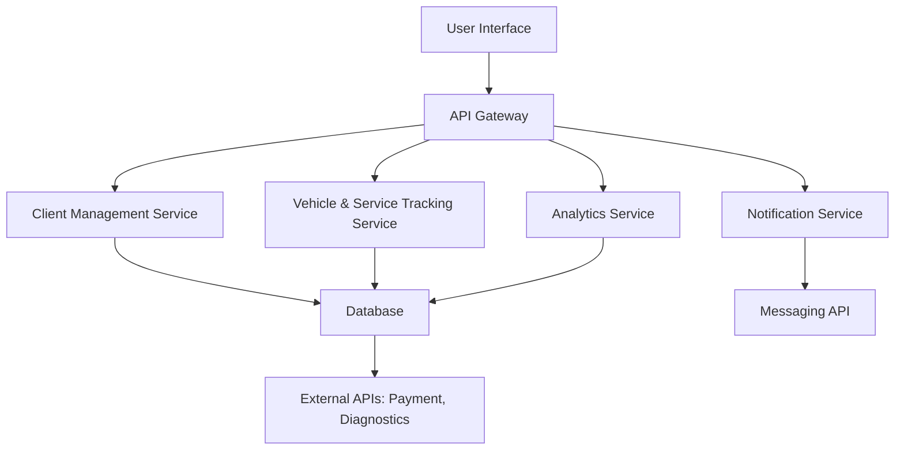
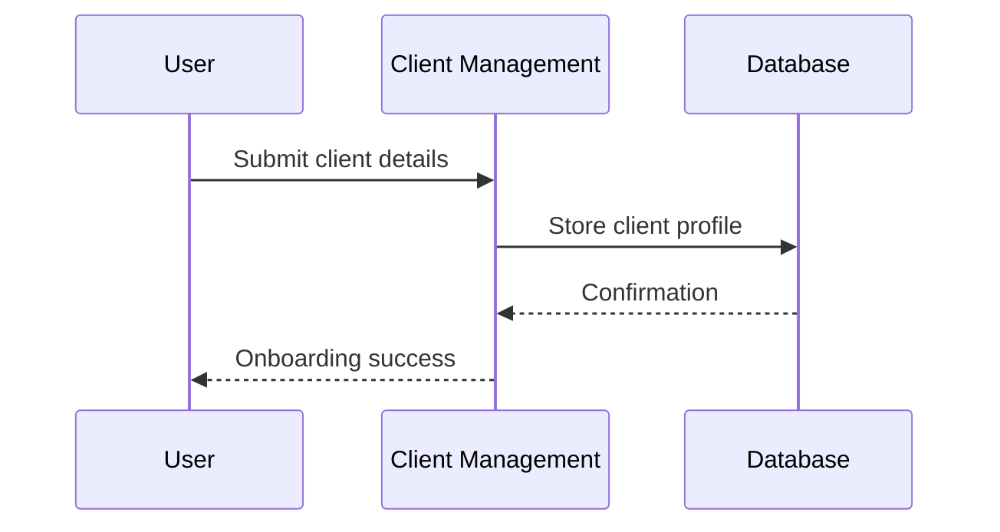
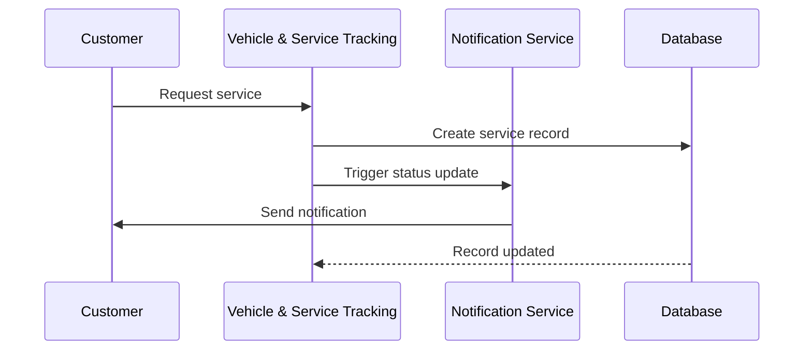

# Ndegwa Auto Concierge Platform - Technical Specification

## 1. Platform Overview

The Ndegwa Auto Concierge platform is a web-based system designed for auto repair shops to efficiently manage customer vehicles, services, and communications. It automates concierge services for vehicle maintenance and management, targeting auto repair shop staff and customers. Core functionalities include client onboarding, service scheduling, real-time tracking, notifications, and performance analytics. The platform integrates with payment processing systems and third-party APIs for vehicle diagnostics to enhance operational efficiency.

Key modules:
- **Client Management**: Handles customer profiles, contact information, and service history.
- **Vehicle & Service Tracking**: Manages vehicle details, service requests, and progress tracking.
- **Notification & Status**: Provides real-time updates via SMS, email, or in-app notifications.
- **Analytics & Reporting**: Generates insights on shop performance, customer trends, and service metrics.

Requirements:
- Scalable to support multiple repair shops and high transaction volumes.
- Secure handling of sensitive customer and vehicle data.
- Real-time capabilities for status updates and notifications.
- Integrations with external APIs for diagnostics and payments.

Constraints:
- Web-based deployment with potential mobile responsiveness.
- Compliance with data protection regulations (e.g., GDPR, local privacy laws).
- Budget considerations for open-source technologies where possible.

## 2. System Architecture

The architecture follows a microservices-based design for modularity, scalability, and maintainability. It consists of the following components:

- **Frontend Layer**: Web application for user interfaces (shop staff and customers).
- **API Gateway**: Manages incoming requests, authentication, and routing to microservices.
- **Microservices**:
  - Client Management Service
  - Vehicle & Service Tracking Service
  - Notification Service
  - Analytics Service
- **Database Layer**: Centralized data storage with read replicas for analytics.
- **External Integrations**: Payment gateways, vehicle diagnostic APIs, messaging services.
- **Infrastructure**: Cloud-hosted (e.g., AWS) with containerization (Docker) and orchestration (Kubernetes).

High-level architecture diagram:

## 3. Technology Stack

### Backend Framework
- **Node.js with Express.js**: Chosen for its asynchronous capabilities, large ecosystem, and suitability for real-time applications. Justified by the need for handling concurrent service requests and integrations.

### Database
- **PostgreSQL**: Relational database for structured data (clients, vehicles, services). Provides ACID compliance, JSON support for flexible schemas, and strong querying for analytics. Justified for data integrity in a transactional environment.

### Frontend
- **React.js**: Component-based library for building dynamic user interfaces. Supports responsive design for web and potential mobile views. Justified for its performance and reusability in managing complex forms and dashboards.

### Messaging and APIs
- **Twilio or SendGrid**: For SMS/email notifications. Justified for reliable, scalable messaging services.
- **Stripe or PayPal API**: For payment processing. Justified for secure, PCI-compliant transactions.
- **Third-party Vehicle Diagnostic APIs** (e.g., OBD-II integrations): For real-time vehicle data. Justified for enhancing service accuracy.

### Additional Tools
- **Docker**: For containerization to ensure consistent deployments.
- **Kubernetes**: For orchestration and scaling microservices.
- **Redis**: For caching and session management to improve performance.
- **JWT**: For authentication and authorization.

## 4. Module Interactions and Interfaces

- **Client Management**: Interfaces with Vehicle & Service Tracking via RESTful APIs to associate clients with vehicles. Exposes endpoints for CRUD operations on client data.
- **Vehicle & Service Tracking**: Core module that interacts with all others. Receives service requests from clients, updates status, and triggers notifications. Integrates with diagnostic APIs for data enrichment.
- **Notification & Status**: Subscribes to events from other modules (e.g., status changes) and sends messages via external APIs. No direct database writes; acts as an event handler.
- **Analytics & Reporting**: Reads from the database to generate reports. Interfaces with external tools for data visualization (e.g., Chart.js).

All interactions use RESTful APIs or event-driven messaging (e.g., RabbitMQ) for loose coupling.

## 5. Data Flow Diagrams

### Client Onboarding Flow

### Service Request Flow

## 6. Security Considerations

- **Authentication & Authorization**: Implement OAuth 2.0 with JWT tokens. Role-based access control (RBAC) for shop staff vs. customers.
- **Data Encryption**: Encrypt sensitive data at rest (e.g., using AES-256) and in transit (TLS 1.3).
- **API Security**: Rate limiting, input validation, and API keys for external integrations.
- **Compliance**: Adhere to GDPR for data handling, with features for data deletion and consent management.
- **Monitoring**: Use tools like OWASP ZAP for vulnerability scanning and logging for audit trails.
- **Best Practices**: Regular security audits, dependency updates, and penetration testing.

## 7. Implementation Guidelines

- **Development Phases**: Start with core modules (Client and Vehicle Tracking), then add notifications and analytics.
- **Testing**: Unit tests with Jest, integration tests for APIs, and end-to-end tests with Cypress.
- **Deployment**: CI/CD pipeline with GitHub Actions for automated builds and deployments.
- **Scalability**: Design for horizontal scaling; use load balancers and database sharding if needed.
- **Documentation**: Maintain API docs with Swagger and code comments for maintainability.
- **Team Structure**: Separate teams for frontend, backend, and DevOps to align with microservices.

This specification provides a foundation for implementation. Further details can be refined during development.