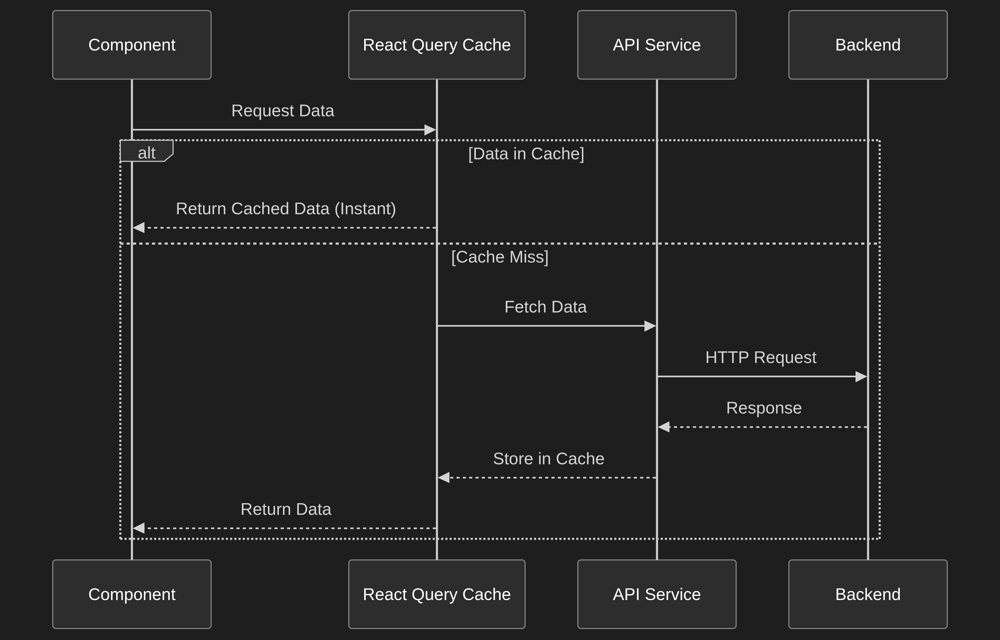

# Auto Concierge

A full-featured web application for auto repair shop management with concierge services. The platform enables efficient management of customer vehicles, services, appointments, and communications.



## Features

### Client Portal
- User registration and authentication
- Browse available services
- Book appointments for vehicle services
- View service history and appointment status
- Track vehicle maintenance information
- Receive real-time notifications

### Admin Dashboard
- Comprehensive analytics and reporting
- Manage clients and service partners
- Appointment oversight and scheduling
- Service partner management
- Vehicle maintenance tracking

## Tech Stack

### Frontend
- **React 18** - UI framework
- **TypeScript** - Type safety
- **Vite** - Build tool
- **Tailwind CSS** - Styling
- **shadcn/ui** - Component library

### Backend
- **Python Flask** - REST API framework
- **SQLite** - Database
- **JWT** - Authentication
- **Flask-JWT-Extended** - Token management

### Additional Services
- **Supabase** - Frontend authentication

## Getting Started

### Prerequisites
- Node.js 18+
- Python 3.10+
- npm or yarn

### Installation

1. **Clone the repository**
   ```bash
   git clone <repository-url>
   cd auto-concierge
   ```

2. **Install frontend dependencies**
   ```bash
   npm install
   ```

3. **Install backend dependencies**
   ```bash
   cd backend
   pip install -r requirements.txt
   ```

### Running the Application

#### Development Mode

**Frontend:**
```bash
npm run dev
```
The frontend will be available at `http://localhost:5173`

**Backend:**
```bash
cd backend
python run.py
```
The API will be available at `http://localhost:5000`

#### Production Mode

**Frontend:**
```bash
npm run build
npm run preview
```

**Backend:**
```bash
cd backend
NODE_ENV=production python run.py
```

## Project Structure

```
auto-concierge/
├── src/                      # React frontend source
│   ├── app/                 # Main application components
│   │   ├── components/      # UI components
│   │   │   ├── admin/       # Admin dashboard components
│   │   │   ├── employee/    # Employee portal components
│   │   │   └── ui/          # Shared UI components
│   │   └── App.tsx          # Main application component
│   ├── contexts/            # React contexts
│   ├── hooks/               # Custom React hooks
│   ├── services/            # API services
│   └── styles/              # Global styles
├── backend/                 # Flask backend source
│   ├── app/
│   │   ├── models/          # Database models
│   │   ├── routes/          # API endpoints
│   │   └── utils/           # Utility functions
│   └── run.py               # Application entry point
├── supabase/                # Supabase edge functions
└── package.json             # Frontend dependencies
```

## API Documentation

Detailed API documentation is available in [`backend/API.md`](backend/API.md).

### Authentication Endpoints
| Method | Endpoint | Description |
|--------|----------|-------------|
| POST | `/api/auth/register` | Register new client |
| POST | `/api/auth/login` | Client login |
| POST | `/api/auth/admin/login` | Admin login |
| POST | `/api/auth/logout` | User logout |
| GET | `/api/auth/profile` | Get user profile |

### Vehicle Endpoints
| Method | Endpoint | Description |
|--------|----------|-------------|
| GET | `/api/vehicles` | List vehicles |
| POST | `/api/vehicles` | Add new vehicle |
| GET | `/api/vehicles/:id` | Get vehicle details |
| PUT | `/api/vehicles/:id` | Update vehicle |

### Appointment Endpoints
| Method | Endpoint | Description |
|--------|----------|-------------|
| GET | `/api/appointments` | List appointments |
| POST | `/api/appointments` | Create appointment |
| GET | `/api/appointments/:id` | Get appointment details |
| PUT | `/api/appointments/:id` | Update appointment |

### Admin Endpoints
| Method | Endpoint | Description |
|--------|----------|-------------|
| GET | `/api/admin/dashboard` | Admin dashboard stats |
| GET | `/api/admin/users` | List all users |
| GET | `/api/admin/users/:id` | Get user details |

## Database Schema

The database schema is documented in [`DATABASE.md`](DATABASE.md) and [`database_schema_design.md`](database_schema_design.md).

### Key Models
- **Users** - Client and admin accounts
- **Vehicles** - Client vehicle information with maintenance tracking
- **Appointments** - Service appointments
- **Services** - Available service offerings
- **Service Partners** - Third-party service providers

## Deployment

The application can be deployed to Render. See [`DEPLOYMENT.md`](DEPLOYMENT.md) for detailed instructions.

### Quick Deploy
1. Create a Render account
2. Connect your GitHub repository
3. Use the `render.yaml` blueprint for automated deployment

### Environment Variables

**Backend (.env.production):**
```env
PORT=10000
NODE_ENV=production
DB_PATH=/opt/render/project/src/auto-concierge.db
JWT_SECRET=your-secret-key
CORS_ORIGIN=https://your-frontend.onrender.com
```

**Frontend (.env.production):**
```env
VITE_API_URL=https://your-backend.onrender.com
VITE_APP_ENV=production
```

## Architecture

For detailed architecture decisions and implementation plans, see [`ARCHITECTURE_PLAN.md`](ARCHITECTURE_PLAN.md).

### Role-Based Access Control
| Role | Permissions |
|------|-------------|
| Client | View services, book appointments, manage own vehicles |
| Admin | Full system access, analytics, user management |

## Contributing

1. Fork the repository
2. Create a feature branch (`git checkout -b feature/amazing-feature`)
3. Commit your changes (`git commit -m 'Add amazing feature'`)
4. Push to the branch (`git push origin feature/amazing-feature`)
5. Open a Pull Request

## License

This project is licensed under the MIT License - see the LICENSE file for details.

## Acknowledgments

- Original design: [Figma](https://www.figma.com/design/6c2dkzMEKmGF4cWTAECb5A/auto-concierge)
- UI Components: [shadcn/ui](https://ui.shadcn.com)