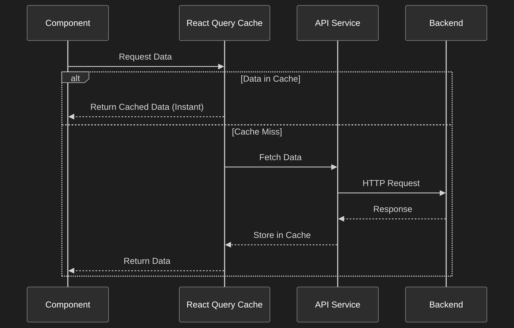

# Ndegwa Auto Concierge

A full-featured web application for auto repair shop management with concierge services. The platform enables efficient management of customer vehicles, services, appointments, employees, fleet operations, payments, and communications.



## Features

### Client Portal
- User registration and authentication
- Browse available services
- Book appointments for vehicle services
- Manage vehicles and view service history
- Track appointment status and receive notifications
- Make payments (M-Pesa, card, cash)
- AI chat assistant

### Employee Portal
- Employee login and profile management
- View assigned appointments
- Update assignment status and work records
- Vehicle checklist and inspection forms
- Time tracking (clock in/out)
- Time-off requests and issue reporting

### Admin Dashboard
- Comprehensive analytics and reporting
- Manage clients, employees, and service partners
- Appointment oversight and scheduling
- Employee approval and management
- Fleet management and billing
- Service partner management
- Invoice generation and PDF exports
- Discount code management
- AI chat configuration

## Tech Stack

### Frontend
- **React 18** - UI framework
- **TypeScript** - Type safety
- **Vite** - Build tool
- **Tailwind CSS v4** - Styling
- **shadcn/ui** - Component library (Radix primitives)
- **MUI** - Additional UI components
- **@tanstack/react-query** - Data fetching and caching
- **lucide-react** - Icons
- **motion** - Animations
- **react-dnd** - Drag and drop
- **recharts** - Charts and analytics
- **sonner** - Toast notifications

### Backend
- **Python Flask 3.0** - REST API framework
- **Flask-SQLAlchemy** - ORM
- **Flask-Migrate** - Database migrations
- **Flask-JWT-Extended** - JWT authentication
- **Flask-CORS** - Cross-origin resource sharing
- **Flask-WTF** - CSRF protection
- **Flask-Limiter** - Rate limiting
- **Flask-Compress** - Response compression
- **SQLite** (dev) / **PostgreSQL 16** (production) - Database
- **Redis** - Caching and rate limiting storage
- **Celery** - Background task queue
- **Gunicorn + Gevent** - Production WSGI server
- **bcrypt** - Password hashing
- **cryptography** - Field encryption
- **fpdf2** - PDF generation
- **Cohere** - AI chat integration

## Getting Started

### Prerequisites
- Node.js 18+
- Python 3.10+
- PostgreSQL 16 (for production)
- Redis (for production)

### Installation

1. **Clone the repository**
   ```bash
   git clone <repository-url>
   cd concierge
   ```

2. **Install frontend dependencies**
   ```bash
   npm install
   ```

3. **Install backend dependencies**
   ```bash
   cd backend
   pip install -r requirements.txt
   ```

4. **Configure environment variables**
   ```bash
   cp backend/.env.example backend/.env
   # Edit .env with your configuration
   ```

### Running the Application

#### Development Mode

**Frontend:**
```bash
npm run dev
```
The frontend will be available at `http://localhost:5173`

**Backend:**
```bash
cd backend
python run.py
```
The API will be available at `http://localhost:5000`

#### Production Mode (Docker)

```bash
docker-compose up --build
```

## Project Structure

```
concierge/
├── src/                          # React frontend source
│   ├── app/                      # Main application components
│   │   ├── components/           # UI components
│   │   │   ├── admin/            # Admin dashboard components
│   │   │   ├── employee/         # Employee portal components
│   │   │   ├── customer/         # Customer portal components
│   │   │   └── ui/               # Shared UI components
│   │   └── App.tsx               # Main application component
│   ├── contexts/                 # React contexts (Auth, RBAC)
│   ├── hooks/                    # Custom React hooks
│   ├── services/                 # API service layer
│   │   └── api/                  # API client modules
│   ├── styles/                   # Global styles
│   └── main.tsx                  # Application entry point
├── backend/                      # Flask backend source
│   ├── app/
│   │   ├── services/             # Domain service modules
│   │   │   ├── auth/             # Authentication & user management
│   │   │   ├── catalog/          # Services & discount codes
│   │   │   ├── vehicles/         # Vehicle management
│   │   │   ├── appointments/     # Appointments & invoices
│   │   │   ├── employees/        # Employee management
│   │   │   ├── partners/         # Service partners
│   │   │   ├── notifications/    # Notifications
│   │   │   ├── payments/         # Payment processing (M-Pesa)
│   │   │   ├── fleets/           # Fleet management
│   │   │   ├── invoices/         # Invoice generation
│   │   │   ├── admin/            # Admin dashboard & audit
│   │   │   ├── workflow/         # Assignment workflow
│   │   │   ├── ai_chat/          # AI chat integration
│   │   │   └── monitoring/       # System monitoring
│   │   ├── utils/                # Utilities (decorators, cache, audit, email)
│   │   ├── core/                 # Core types and encryption
│   │   ├── tasks/                # Celery background tasks
│   │   └── migrations/           # Alembic database migrations
│   ├── run.py                    # Application entry point
│   ├── requirements.txt          # Python dependencies
│   └── gunicorn.conf.py          # Gunicorn configuration
├── nginx/                        # Nginx reverse proxy config
├── docker-compose.yml            # Docker orchestration
├── render.yaml                   # Render deployment blueprint
├── package.json                  # Frontend dependencies
├── vite.config.ts                # Vite configuration
├── tsconfig.json                 # TypeScript configuration
└── README.md                     # This file
```

## API Documentation

Detailed API documentation is available in [`backend/API.md`](backend/API.md).

### Authentication Endpoints
| Method | Endpoint | Description |
|--------|----------|-------------|
| POST | `/api/auth/register` | Register new customer or employee |
| POST | `/api/auth/login` | Customer login |
| POST | `/api/auth/employee/login` | Employee login |
| POST | `/api/auth/admin/login` | Admin login |
| POST | `/api/auth/refresh` | Refresh access token |
| POST | `/api/auth/logout` | User logout |
| GET | `/api/auth/verify-token` | Verify JWT token |
| GET | `/api/auth/profile` | Get user profile |
| PUT | `/api/auth/profile` | Update user profile |
| POST | `/api/auth/change-password` | Change password |

### Service Endpoints
| Method | Endpoint | Description |
|--------|----------|-------------|
| GET | `/api/services/` | List active services |
| GET | `/api/services/:id` | Get service details |

### Vehicle Endpoints
| Method | Endpoint | Description |
|--------|----------|-------------|
| GET | `/api/vehicles/` | List user vehicles |
| POST | `/api/vehicles/` | Add new vehicle |
| GET | `/api/vehicles/:id` | Get vehicle details |
| PUT | `/api/vehicles/:id` | Update vehicle |
| DELETE | `/api/vehicles/:id` | Delete vehicle |

### Appointment Endpoints
| Method | Endpoint | Description |
|--------|----------|-------------|
| GET | `/api/appointments/` | List appointments |
| POST | `/api/appointments/` | Create appointment |
| GET | `/api/appointments/:id` | Get appointment details |
| PUT | `/api/appointments/:id` | Update appointment |
| DELETE | `/api/appointments/:id` | Cancel appointment |
| POST | `/api/appointments/:id/confirm-return` | Confirm vehicle return |

### Employee Endpoints
| Method | Endpoint | Description |
|--------|----------|-------------|
| GET | `/api/employees/dashboard` | Employee dashboard |
| GET | `/api/employees/assignments` | Get my assignments |
| PUT | `/api/employees/assignments/:id` | Update assignment status |
| GET | `/api/employees/schedule` | Get my schedule |
| GET | `/api/employees/profile` | Get employee profile |
| PUT | `/api/employees/profile` | Update profile |
| POST | `/api/employees/clock` | Clock in/out |
| GET | `/api/employees/time-logs` | Get time logs |
| POST | `/api/employees/time-off` | Request time off |
| GET | `/api/employees/time-off` | Get time-off requests |
| POST | `/api/employees/issues` | Report an issue |
| GET | `/api/employees/issues` | Get issue reports |

### Admin Endpoints
| Method | Endpoint | Description |
|--------|----------|-------------|
| GET | `/api/admin/dashboard` | Admin dashboard stats |
| GET | `/api/admin/users` | List all users |
| GET | `/api/admin/users/:id` | Get user details |
| GET | `/api/admin/appointments` | List all appointments |
| GET | `/api/admin/service-history` | Get service history |
| POST | `/api/admin/notifications` | Create notification |
| POST | `/api/admin/discounts` | Create discount code |

### Employee Management (Admin)
| Method | Endpoint | Description |
|--------|----------|-------------|
| POST | `/api/employees/admin/employees` | Register employee |
| GET | `/api/employees/admin/employees` | List employees |
| GET | `/api/employees/admin/employees/:id` | Get employee details |
| PUT | `/api/employees/admin/employees/:id` | Update employee |
| DELETE | `/api/employees/admin/employees/:id` | Deactivate employee |
| PUT | `/api/employees/admin/employees/:id/status` | Update status |
| POST | `/api/employees/admin/appointments/:id/assign` | Assign employee |

### Fleet Management
| Method | Endpoint | Description |
|--------|----------|-------------|
| GET | `/api/fleets/companies` | List companies |
| POST | `/api/fleets/companies` | Create company |
| GET | `/api/fleets/companies/:id` | Get company details |
| PUT | `/api/fleets/companies/:id` | Update company |
| DELETE | `/api/fleets/companies/:id` | Delete company |
| GET | `/api/fleets/companies/:id/vehicles` | Get company vehicles |
| POST | `/api/fleets/companies/:id/vehicles` | Add fleet vehicle |
| GET | `/api/fleets/companies/:id/expenses` | Get company expenses |
| POST | `/api/fleets/companies/:id/invoices` | Generate fleet invoice |

### Payment Endpoints
| Method | Endpoint | Description |
|--------|----------|-------------|
| POST | `/api/payments/mpesa/stk-push` | Initiate M-Pesa payment |
| GET | `/api/payments/:id/status` | Check payment status |
| GET | `/api/payments/:id` | Get payment details |
| GET | `/api/payments/appointment/:id` | Get payments for appointment |

### Other Endpoints
| Method | Endpoint | Description |
|--------|----------|-------------|
| GET | `/api/notifications/` | Get notifications |
| PUT | `/api/notifications/:id/read` | Mark notification read |
| PUT | `/api/notifications/read-all` | Mark all as read |
| GET | `/api/partners/` | List service partners |
| POST | `/api/partners/admin` | Create partner |
| PUT | `/api/partners/admin/:id` | Update partner |
| DELETE | `/api/partners/admin/:id` | Deactivate partner |
| POST | `/api/ai-chat/chat` | AI chat message |
| GET | `/api/workflow/assignments/:id` | Get assignment workflow detail |
| POST | `/api/workflow/assignments/:id/start` | Start assignment |
| GET | `/api/health` | Health check |

## Database Schema

The database schema is documented in [`DATABASE.md`](DATABASE.md).

### Key Models
- **User** - Customer, employee, and admin accounts
- **PaymentMethod** - User payment methods
- **Service** - Available service offerings
- **DiscountCode** - Promotional codes
- **Vehicle** - Customer vehicle information
- **Appointment** - Service appointments
- **ServiceHistory** - Completed service records and reviews
- **Assignment** - Employee assignments to appointments
- **Notification** - User notifications
- **Employee** - Employee profiles and details
- **EmployeeDocument** - Employee uploaded documents
- **EmployeeTimeLog** - Employee clock in/out records
- **TimeOffRequest** - Employee time-off requests
- **IssueReport** - Employee issue reports
- **ServicePartner** - Third-party service providers
- **AuditLog** - System audit trail
- **Company** - Fleet companies
- **FleetVehicle** - Fleet vehicles
- **FleetExpense** - Fleet expenses
- **Invoice** - Invoices for appointments and fleets
- **Payment** - Payment transactions
- **WebhookEvent** - Persisted webhook payloads

## Deployment

The application can be deployed using Docker Compose or to Render. See [`DEPLOYMENT.md`](DEPLOYMENT.md) for detailed instructions.

### Quick Deploy with Docker

```bash
docker-compose up --build
```

### Quick Deploy to Render

1. Push your code to GitHub
2. Connect your repository to Render
3. Use the `render.yaml` blueprint for automated deployment

### Environment Variables

**Backend:**
| Variable | Description |
|----------|-------------|
| `DATABASE_URL` | PostgreSQL connection string |
| `DATABASE_READ_URL` | Read replica connection string |
| `REDIS_URL` | Redis connection string |
| `SECRET_KEY` | Flask secret key |
| `JWT_SECRET_KEY` | JWT signing secret |
| `ENCRYPTION_KEY` | Field encryption key (base64, 32 bytes) |
| `CORS_ORIGIN` | Allowed frontend origin(s) |
| `FLASK_ENV` | Environment (`development` or `production`) |
| `MAIL_SERVER` | SMTP server for emails |
| `MPESA_CONSUMER_KEY` | M-Pesa API consumer key |
| `MPESA_CONSUMER_SECRET` | M-Pesa API consumer secret |
| `COHERE_API_KEY` | Cohere AI API key |

**Frontend:**
| Variable | Description |
|----------|-------------|
| `VITE_API_URL` | Backend API URL |

## Role-Based Access Control

| Role | Permissions |
|------|-------------|
| Customer | View services, book appointments, manage own vehicles, make payments |
| Employee | View assignments, update status, clock in/out, request time off |
| Admin | Full system access, analytics, user management, employee approval |
| Super Admin | Admin permissions plus admin account creation |

## License

This project is licensed under the MIT License - see the LICENSE file for details.

## Acknowledgments

- UI Components: [shadcn/ui](https://ui.shadcn.com)
- Icons: [lucide-react](https://lucide.dev)
- Charts: [recharts](https://recharts.org)
